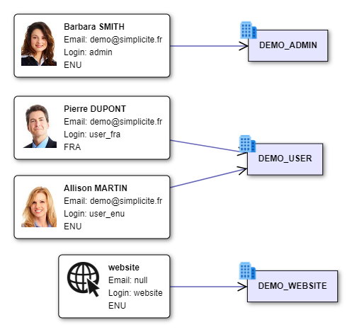
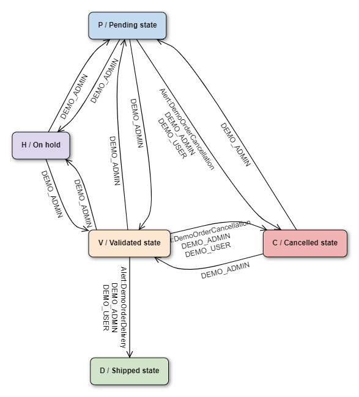
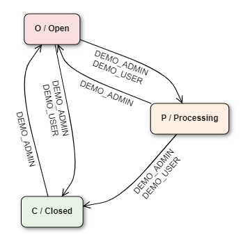

* * *

Business case
=============

The business case is a very simple wholesale **order management** application.

The application has one backend user interface which is based on the standard Simplicit&eacute;&reg; user interface.
This user interface is only used by internal users to manage reference data (suppliers, products, customers, ...)
and to enter and manage customer orders and contacts.

It also has various public frontend user interfaces which allow customers to place their own orders.

Some business rules, including right rules, applies on all business objects some of which depends on the user profile.

The 2 back office business user profiles are administrator and plain user. Administrators manages all reference data,
enters and/or validate orders. Plain users are only responsible for entering and finalizing orders.

Business data
-------------

The data model consist of 5 business objects:

- Suppliers who supply products
- Products supplied by suppliers and that can be ordered
- Customers who order products
- Orders placed by customers on products
- Contacts from customer

NB: Orders are for 1 customer and 1 product (mono-product orders), a quantity can be set (minimum order quantity is 1)

User profiles
-------------

Thes **Administrator** profile is a back office profile. He has full access to the order management application:
he can manage all data including orders and has also access to users management. He is the only profile
to be allowed to validate orders.

The **Plain user** profile is also a back office profile. He has read only access to reference data. He has write
access on orders but is restricted to the orders placed on a product from one of its designated suppliers.
He is not allowed to validate pending orders.

The **Customer** profile is a front office profile. He has only access to dedicated custom user interfaces (web site, mobile app, ...).
He is only allowed to place new orders. He can optionally also review the list of all his previous orders.

Business workflows
------------------

### Order states

Orders can be in the following statuses:

- **Pending** as the initial status
- **Validated** when validated by the administrator profile
- **Shipped** when actually shipped to the customer
- **Cancelled** if cancelled (cannot be cancelled when marked as shipped)

### Contacts states

Contacts can be in the following statuses:

- **Open** as the initial status
- **Processing** when it requires long processing
- **Closed** when contact is considered to be fully processed

### Place new order screen flow

The screen flow for back office order entry is a 4 step linear screen flow:

- Select one customer from the customers list
- Select one supplier from the suppliers list
- Select one product out of the selected supplier's products
- Review the order summary, enter a quantity and submit it

> Note: this screen flow is only an assisted process doing what can be done using plain
> business objects user interfaces. This screen flow does not bring any additional business rules.

Business rules
--------------

### Supplier related business rules

Supplier can only be created and updated by the administrator profile.
A single plain user can be designated as the supplier responsible
(this link is taken into account for access rights to orders).

### Product related business rules

A supplier can only be created and updated by the administrator profile.
Changes on either product reference, product name or unit price is historized.

### Customers-related business rules

A customer can only be created and updated by the administrator profile.

### Order related business rules

Orders can be placed either by backend users (administrator or plain user) or by
frontend users (customers themselves).

An order is for one customer and one product.

Regardless of the order entry origin, the following business rules applies to orders:

- The order customer and product can only be selected at creation
- The quantity can only be updated when order status is pending
- The quantity must be between 1 and current product stock
- The product's stock is actually decreased when order is marked as shipped

### Contact related business rules

A contact is only entered by back office users and must be attached at least to a customer,
and optionally to an order of this customer.

Custom components
-----------------

### Simplified order entry page

An optional user interface component is provided to provide a back office "single order entry page".

As for the order entry screen flow, this component is optional and does not include any additional
business rules if compared to what can be done with plain business object pages.

### Public frontends

Various public frontends are available as dedicated modules.

The web site one allows customers to place new orders.
The only authentication mechanism for customers is to enter their customer code.
This web site is based on the Bootstrap&reg; web framework.

Others
------

### Pivot tables

Various pivot tables are defined on the order business object:

- Number of orders per date dans status
- Order turnover by supplier, product reference and status
- Etc.

### Publications / integration

An order receipt publication is provided for for validated and shipped orders:

The application also provides some custom technical publications and APIs for integration.

